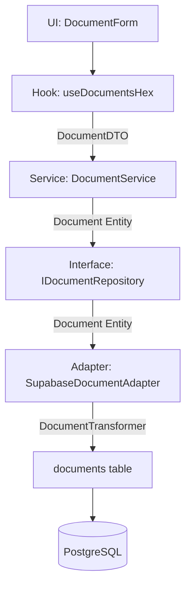
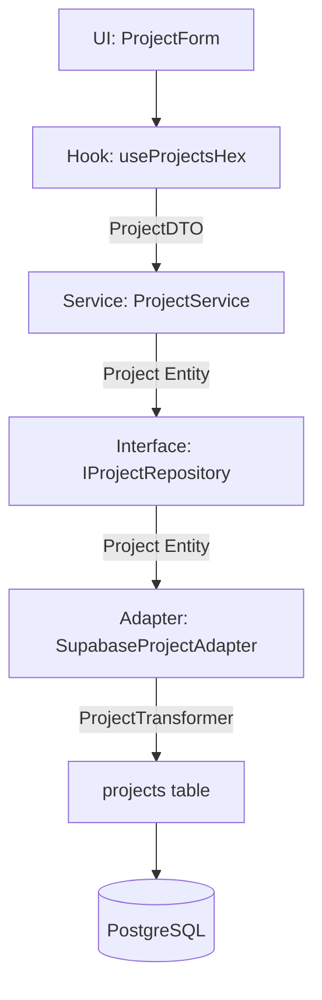
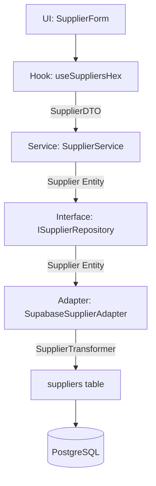
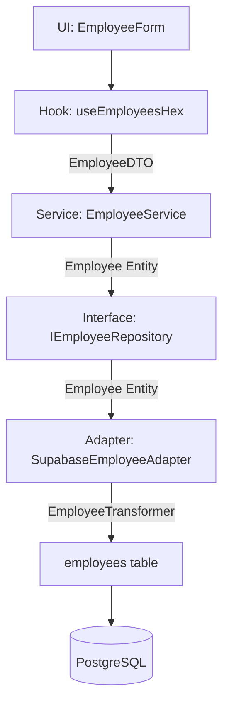
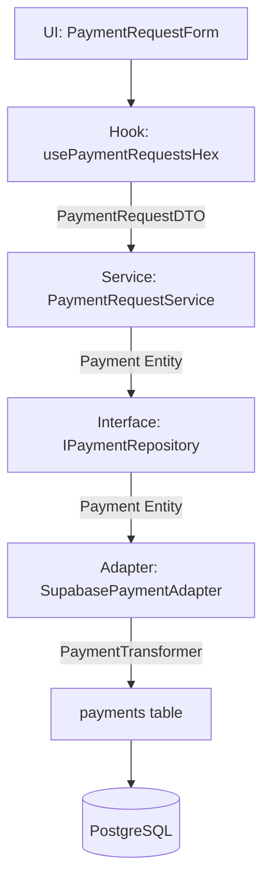
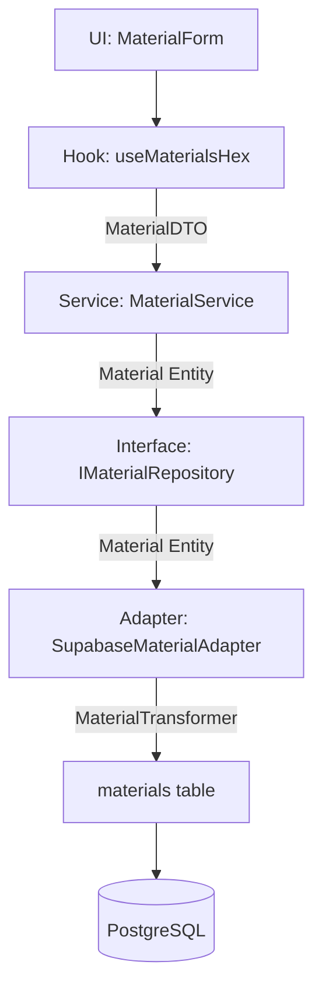
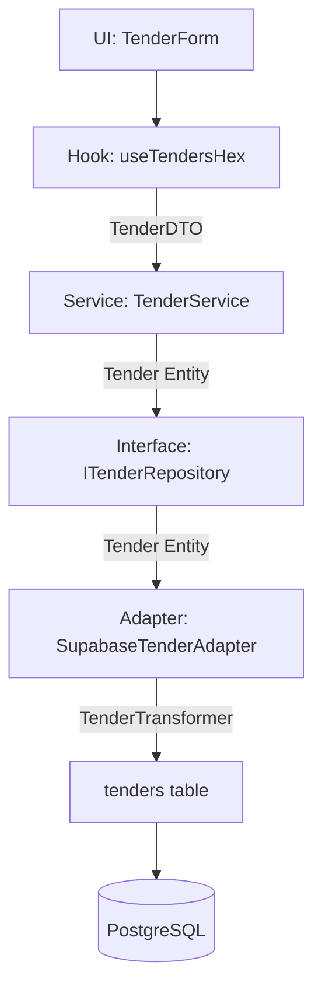
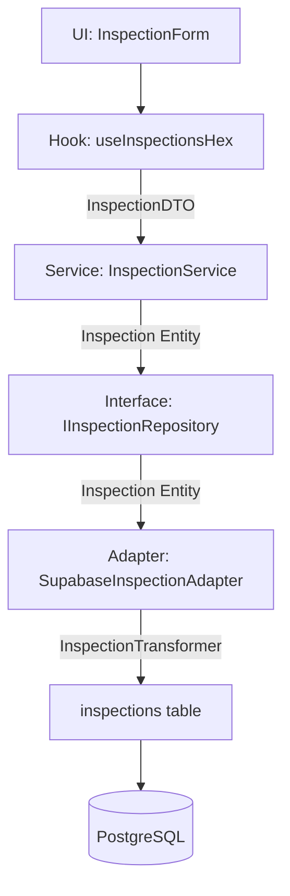

# Architecture Hexagonale - Flux Complet pour Toutes les UI

## 🔄 **Schéma Général du Flux**

```mermaid
graph TD
    %% Flux normal (création)
    A[UI: FormData] -->|JSON natif| B[Hook: use*Hex]
    B -->|*DTO| C[Service: *Service]
    C -->|* Entity| D[Interface: I*Repository]
    D -->|* Entity| E[Adapter: Supabase*Adapter]
    E -->|*Transformer| F[Modèle DB: SupabaseRow]
    F -->|INSERT/UPDATE| G[(BDD: PostgreSQL)]
    
    %% Flux retour (lecture)
    G -->|Rows JSON| F
    F -->|*Transformer| E
    E -->|* Entity| D
    D -->|* Entity| C
    C -->|*DTO| B
    B -->|*DTO[]| A
    
    %% Transformations clés
    subgraph "Zone de Transformation"
        T1[FormData → DTO]
        T2[DTO → Entity]
        T3[Entity → DTO]
        T4[Entity → DB Row]
        T5[DB Row → Entity]
    end
    
    B -.-> T1
    C -.-> T2
    C -.-> T3
    E -.-> T4
    E -.-> T5
    
    style A fill:#e1f5fe
    style B fill:#f3e5f5
    style C fill:#e8f5e8
    style D fill:#c8e6c9
    style E fill:#ffecb3
    style F fill:#fff3e0
    style G fill:#ffebee
```

## 📋 **Application par Domaine**

### **1. Documents**


### **2. Projets**


### **3. Fournisseurs**


### **4. Employés**


### **5. Paiements**


### **6. Matériaux**


### **7. Tenders (Appels d'offres)**


### **8. Inspections**


## 🎯 **Mapping des Composants UI → Hooks**

| Composant UI | Hook Hexagonal | Service | Repository | Adapter |
|--------------|----------------|---------|------------|---------|
| `DocumentForm.tsx` | `useDocumentsHex` | `DocumentService` | `IDocumentRepository` | `SupabaseDocumentAdapter` |
| `ProjectForm.tsx` | `useProjectsHex` | `ProjectService` | `IProjectRepository` | `SupabaseProjectAdapter` |
| `SupplierForm.tsx` | `useSuppliersHex` | `SupplierService` | `ISupplierRepository` | `SupabaseSupplierAdapter` |
| `EmployeeForm.tsx` | `useEmployeesHex` | `EmployeeService` | `IEmployeeRepository` | `SupabaseEmployeeAdapter` |
| `PaymentRequestForm.tsx` | `usePaymentRequestsHex` | `PaymentRequestService` | `IPaymentRepository` | `SupabasePaymentAdapter` |
| `MaterialForm.tsx` | `useMaterialsHex` | `MaterialService` | `IMaterialRepository` | `SupabaseMaterialAdapter` |
| `TenderForm.tsx` | `useTendersHex` | `TenderService` | `ITenderRepository` | `SupabaseTenderAdapter` |
| `InspectionForm.tsx` | `useInspectionsHex` | `InspectionService` | `IInspectionRepository` | `SupabaseInspectionAdapter` |

## 🔄 **Pattern de Transformation Standard**

### **1. UI → Hook (FormData → DTO)**
```typescript
// Dans le composant UI
const handleSubmit = async (formData: FormData) => {
  const dto = new CreateDocumentRequestDto(
    formData.get('title') as string,
    formData.get('description') as string,
    formData.get('type') as DocumentType,
    formData.get('projectId') as string
  );
  
  await createDocument(dto);
};
```

### **2. Hook → Service (DTO → Entity)**
```typescript
// Dans le hook hexagonal
const createMutation = useMutation({
  mutationFn: async (dto: CreateDocumentRequestDto) => {
    const entity = DocumentMapper.toDomainFromCreateDto(dto, userId);
    return await documentService.createDocument(entity);
  }
});
```

### **3. Service → Repository (Entity)**
```typescript
// Dans le service
async createDocument(document: Document): Promise<Document> {
  await this.documentRepository.save(document);
  return document;
}
```

### **4. Repository → Adapter (Entity)**
```typescript
// Dans l'adapter
async save(document: Document): Promise<void> {
  const dbRow = DocumentTransformer.toDbRow(document);
  await supabase.from('documents').insert(dbRow);
}
```

### **5. Adapter → BDD (DB Row)**
```sql
-- Requête SQL générée
INSERT INTO documents (id, title, description, document_type, status, created_at, updated_at)
VALUES ($1, $2, $3, $4, $5, $6, $7);
```

## 📊 **Structure des Fichiers**

```
src/
├── components/                    # UI Layer
│   ├── documents/
│   │   ├── DocumentForm.tsx
│   │   └── DocumentList.tsx
│   ├── projects/
│   │   ├── ProjectForm.tsx
│   │   └── ProjectList.tsx
│   └── suppliers/
│       ├── SupplierForm.tsx
│       └── SupplierList.tsx
├── hooks/hexagonal/              # Hook Layer
│   ├── useDocumentsHex.ts
│   ├── useProjectsHex.ts
│   ├── useSuppliersHex.ts
│   └── usePaymentRequestsHex.ts
├── application/services/         # Service Layer
│   ├── DocumentService.ts
│   ├── ProjectService.ts
│   ├── SupplierService.ts
│   └── PaymentRequestService.ts
├── domain/                       # Domain Layer
│   ├── entities/
│   │   ├── Document.ts
│   │   ├── Project.ts
│   │   └── Supplier.ts
│   └── repositories/
│       ├── IDocumentRepository.ts
│       ├── IProjectRepository.ts
│       └── ISupplierRepository.ts
└── infrastructure/               # Infrastructure Layer
    ├── adapters/
    │   ├── SupabaseDocumentAdapter.ts
    │   └── SupabaseProjectAdapter.ts
    └── transformers/
        ├── DocumentMapper.ts
        └── ProjectMapper.ts
```

## 🎯 **Règles d'Architecture**

✅ **UI Layer** : Uniquement des composants React avec FormData
✅ **Hook Layer** : Gestion d'état + transformation FormData ↔ DTO
✅ **Service Layer** : Logique métier pure avec entités du domaine
✅ **Repository Layer** : Interfaces d'accès aux données
✅ **Adapter Layer** : Mapping Supabase ↔ Entités du domaine
✅ **Transformer Layer** : Conversion centralisée DTO ↔ Entity

Ce flux garantit une architecture hexagonale cohérente pour toute l'application !
